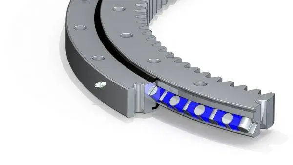
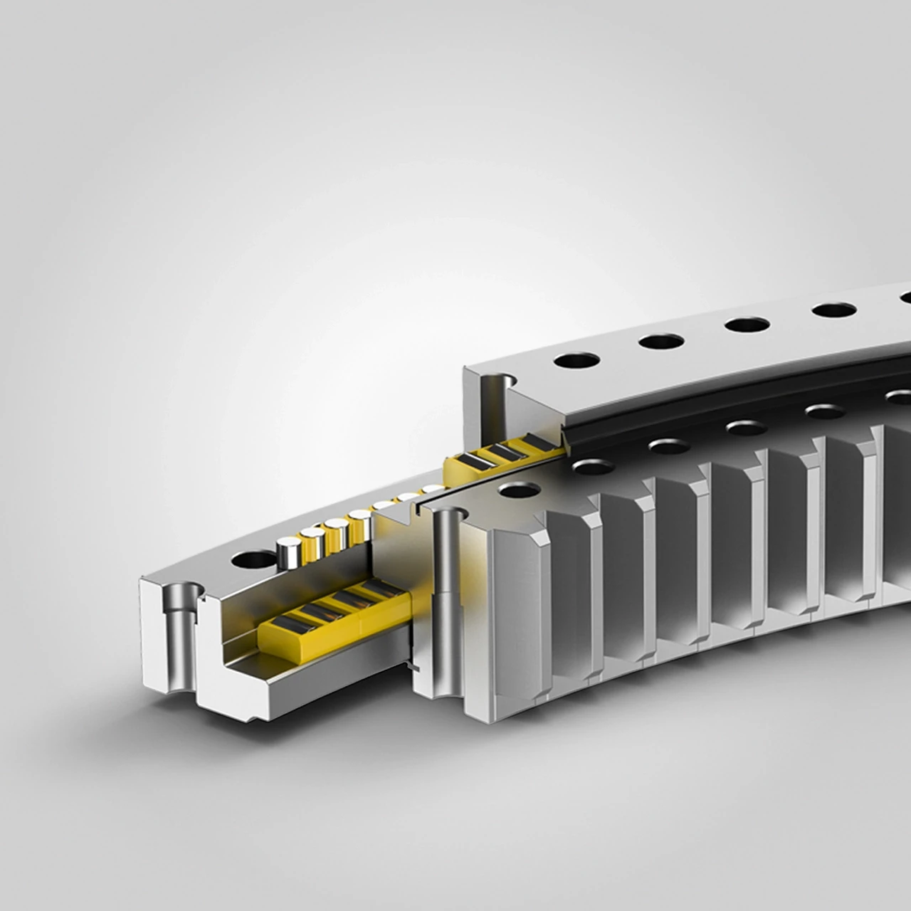
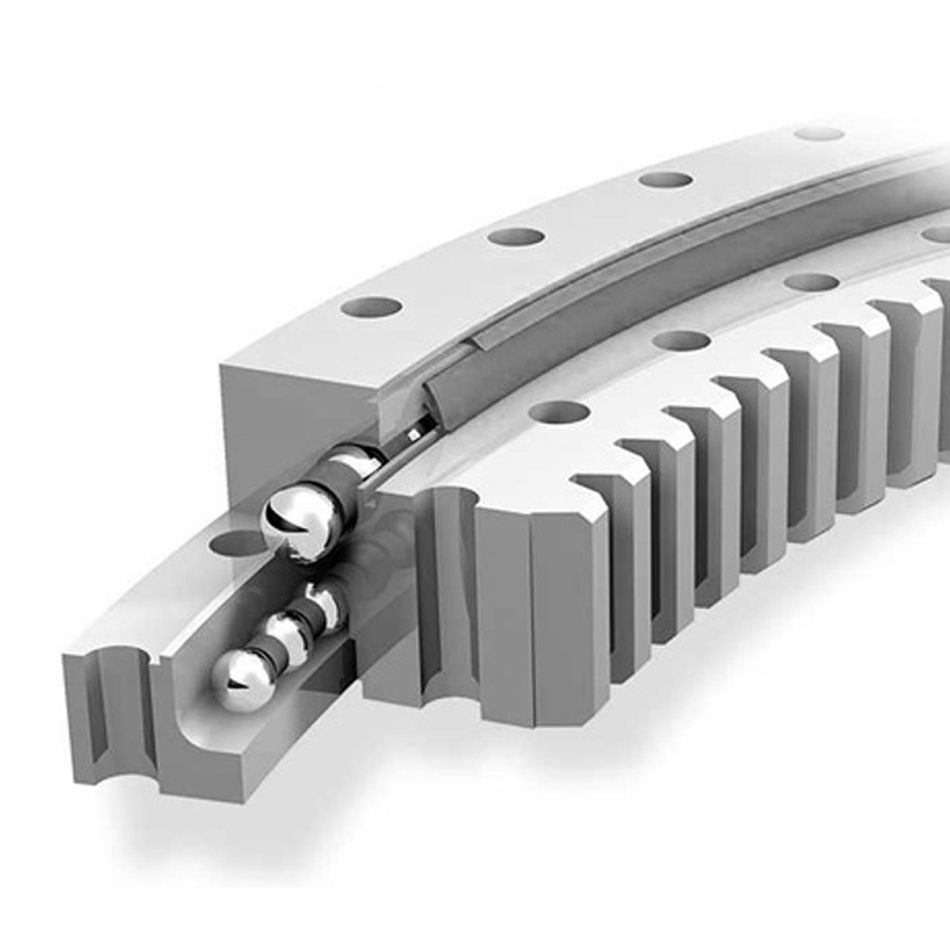
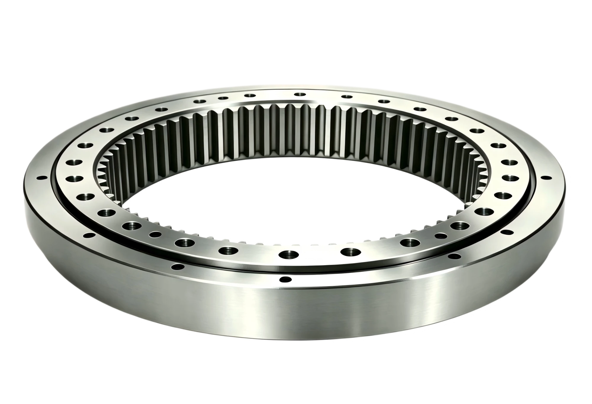

# Discoball Installation (side project)

> Small art installation: a discoball resting (not hanging) in a rotating 3D-printed bowl bearing, driven by a DMX-controlled stepper motor via an internal ring gear. Prototype scale: 30cm discoball. Adjacent to the main [[v3]] hardware lineage but not a PitchPlease light-pole device — a separate build that reuses some of the same knowledge (ESP32 + DMX receive, 12V supply).

## Concept

The discoball sits in a custom bowl-shaped 3D-printed bearing/holder rather than hanging from a motor above it, as traditional disco balls do. Only the vertical axis rotates. The holder itself doubles as the driven half of a gearbox: its inside edge carries an internal ring gear (slewing-ring style, ~8cm diameter), meshed with a small pinion mounted directly on a stepper motor shaft positioned off to the side — so the motor doesn't need to sit in the ball's rotational axis or route a shaft up through the bowl's centre.

Target rotation range: a slow ambient default (~1–3 RPM, precision matters most here) and an optional fast "strobe" mode (~up to 60 RPM) where the ball's reflections sweep visibly across the floor/walls. That's roughly a 20× speed range that the drive needs to cover smoothly.

## PCB v3.2 reuse — considered and rejected

Early idea was to repurpose the existing [[v3]] PCB (ESP32 + DMX receiver + 12V rail, normally driving 4× WS2811 LED strips) to drive the motor instead of a strip, i.e. "hijack" one of its 4 LED header outputs. On inspection this doesn't hold up: those 4 outputs are 5V **logic-level** signals (GPIO → 74AHCT125 buffer → series resistor → header, see [[v3]] LED driver path) meant for a WS2811 data line, not a power output — there's no driver stage on the board capable of switching motor current. Reusing the PCB would only really mean reusing the ESP32 + DMX receiver + 12V terminal, with a full motor driver still bolted on externally; everything LED-specific becomes dead weight. Also, the TB6612/stepper driver logic pins don't need 5V-buffered signals in the first place (see below), so the buffer stage brings no benefit here.

**Decision: build the prototype standalone on a breadboard** — ESP32 + MAX485 (DMX in) + stepper driver + stepper motor + 12V PSU — rather than adapting v3.2. Simpler, and doesn't tie this side project's iteration to the light-pole PCB's revision history.

## Motor & drive selection

### Load analysis

The bowl supports the ball's full weight; the motor only overcomes rotational friction at the bearing interface, not the ball's weight. For a ~30cm/~400g ball on a printed pivot of radius ~10–15mm with a dry-plastic friction coefficient (~0.3), estimated friction torque is on the order of **0.02 N·m (~0.2 kg·cm)** — trivial. Torque was never the constraining spec for motor selection; RPM range and speed-control precision were.

### DC gear motor + TB6612 — considered and rejected

First plan (before the ring-gear mechanism was decided) was a 12V DC gear motor with a TB6612FNG H-bridge, PWM'd for speed. Once the ring-gear reduction made a wide 20× speed range with **precise low-speed control** the actual requirement, this was dropped: open-loop PWM speed control on a brushed DC motor is nonlinear at low duty cycle (static friction creates a dead zone before the motor "breaks free"), which fights exactly the low-speed precision this project needs most. Achieving that with a DC motor would require closed-loop control (encoder + PID) — unnecessary complexity given a stepper solves it for free.

### Stepper motor — chosen

A stepper's speed is just step-pulse frequency, so 3 RPM and 60 RPM are both open-loop-controllable with no dead zone, and the torque margin from the ring-gear reduction plus the motor's own holding torque (17 Ncm vs. ~0.02 Nm required) is large.

**Selected parts** (ordered, per [[2026-09-06_stepperonline-17he08-1004s-datasheet]] ingest):

| Part | Spec | Notes |
|---|---|---|
| Motor | StepperOnline **17HE08-1004S** — NEMA17 pancake, 23mm body | 17 Ncm holding torque, 1A/phase, 1.8°/step (200 steps/rev), 5mm shaft w/ flat, 4-wire bipolar |
| Driver | **TMC2209 V2.0** (GERUI clone, pack of 2, with heatsink) — purchased, [Amazon B0D6R7YCRT](https://www.amazon.de/dp/B0D6R7YCRT) | Peak 2.5A / continuous 1.8A — comfortable margin over motor's 1A; UART-capable; "stealthChop" silent mode chosen specifically for near-silent operation in an ambient art piece (vs. audible A4988/DRV8825) |

Motor body length deliberately kept to the shortest/cheapest option — holding torque at this size is already ~15–20× the actual load, so a longer/higher-torque body would only add cost, weight, and current draw with no benefit.

### Wiring notes

- **TMC2209 logic (VIO) is a separate pin from motor power (VM)** — tie VIO to the ESP32's 3.3V rail, no level shifter/buffer (e.g. 74AHCT125) needed. STEP/DIR/EN read correctly at 3.3V thresholds. Confirmed against the standard TMC2209 breakout reference pinout (cloned across the 3D-printer-driver market specifically to support both 5V and 3.3V control boards) and corroborated by reviews on the purchased listing (ESP32-S2/ESP8266 users reporting working UART/STEP-DIR control).
- **Motor pinout** (from datasheet, differs slightly from generic assumption — confirm against this table when wiring, not just connector silkscreen):

  | Pin | Winding | Lead colour |
  |---|---|---|
  | 1 | A+ | Black |
  | 3 | A− | Blue |
  | 2 | B+ | Green |
  | 4 | B− | Red |

- **Set the TMC2209 current-limit trimpot** to roughly match the motor's 1A/phase rating before first power-up (with motor disconnected while measuring Vref, per module's own warning) — several reviews of this specific clone board report DOA/smoke failures, most plausibly from skipping this step or wiring polarity errors rather than a batch defect, but worth being deliberate about given the pattern. Bought as a pack of 2 as a hedge.

## Mechanical design

### Ring gear / pinion

Internal ring gear (slewing-ring style — pinion sits inside the ring, meshing outward), ~8cm ring diameter, driven by a small printed pinion on the stepper shaft. This gives an additional mechanical reduction stage on top of the stepper's native resolution — e.g. a 40-tooth ring at module 2mm against a 10-tooth pinion ≈ 4:1 — meaning the motor shaft itself needs to run roughly 4× the ring's target speed (so ~12–240 RPM motor-shaft range for the 3–60 RPM ring target), comfortably within normal stepper operating range.

Module and tooth counts are not yet finalised (see Open Questions).

### Terminology: slewing bearing

The proper technical term for what is being designed under the discoball — a rotating platform whose bearing and drive gear are one part, driven by a small pinion — is a **slew bearing / slewing bearing** (also "slewing ring"), specifically the variant with **internal gear teeth** (confirmed by Miro on 2026-09-25 — an earlier note said "internal thread", which was a slip of wording). Useful search term for finding printable designs, tooth geometry, and bearing-race approaches, since it covers both the bearing race and the ring gear in one component rather than treating them as separate problems. Reference video, saved on 2026-09-25: [Slew Bearing Design & Manufacture — Mahdi Designs](https://www.youtube.com/watch?v=CtQzOOL7SQg) (title and channel only; contents not reviewed or summarised here).

#### Inspiration images

Four product renders of industrial slewing bearings, saved 2026-09-25 as inspiration for the **general principle**, not the size or load class (they are built for far heavier loads than a 30cm discoball). What they share, and what the printed version should aim for: two concentric rings that rotate relative to each other, with the rolling elements (balls or rollers) captured in a raceway between them; one ring carries the gear teeth; both rings carry mounting holes; a seal closes the gap between the rings.

Cutaway with a row of rollers in a blue cage, external teeth and a grease nipple. Shows how the raceway is split across the two rings.

Cutaway with several rows of cylindrical rollers in yellow cages, external teeth and a black seal along the top gap.

Ball-type version: balls running in a curved raceway, with a seal strip over the gap. The ball type is likely the closest match for a printed version, since standard steel balls are cheap and easy to source.

A complete ring with **internal gear teeth**, the variant this project needs, with mounting holes on both rings. Only this image shows internal teeth; the other three are external.

### Bearing

*Note (2026-09-25): the slewing-bearing references above suggest replacing this plain-pivot plan with a proper split raceway holding balls or rollers; not yet decided.*

Bowl-shaped bearing interface currently planned as a **3D-printed cylindrical pivot between two flat printed plates** — effectively a plain thrust bearing, plastic-on-plastic (PLA/PETG), no bearing hardware. Flagged as the most likely weak point in the whole build: dry plastic-on-plastic friction is high and inconsistent (worse in static/stiction than once moving), will wear/generate dust over time, and any warp in the printed discs shows up as wobble or local binding — all of which would undercut the smooth, ambient look the installation is going for, independent of how good the motor/driver choice is. Recommended mitigation (not yet decided): either a thin PTFE/UHMW washer between the printed faces, or swap in a cheap off-the-shelf thrust ball bearing at the pivot.

## Open Questions

- Bearing interface: PLA-on-PLA thrust pivot vs. PTFE washer vs. real thrust bearing — undecided. This affects both friction-torque assumptions (used above) and expected wear/service life.
- Ring gear module and tooth counts not finalised — internal tooth profiles print less predictably than external teeth on FDM, so a small test-sector print against the pinion is recommended before committing to a full ~8cm ring print.
- Internal vs. external gear orientation was decided (internal/slewing-ring), but exact center-distance tolerancing for the mesh hasn't been worked out yet.
- DMX channel mapping for speed + direction (e.g. one channel as signed speed, 128 = stop) not yet designed.
- ~~"Internal thread" wording for the slewing bearing~~ — resolved 2026-09-25: Miro confirmed it means internal gear teeth, not a threaded interface.
- Firmware not yet started — would reuse DMX-receive logic conceptually similar to [[v3]]'s MAX485/DMX path, but as a standalone sketch, not a v3.2 PCB fork.

## See Also

- [[v3]] — source of the PCB v3.2 reuse idea (rejected) and the DMX/MAX485 receive approach this project's firmware will conceptually borrow from
- [[hardware]] — cross-version hardware summary for the main PitchPlease devices
- [[2026-09-06_stepperonline-17he08-1004s-datasheet]] — ingested motor datasheet
- [Slew Bearing Design & Manufacture (YouTube, Mahdi Designs)](https://www.youtube.com/watch?v=CtQzOOL7SQg) — reference for the slewing-bearing design
