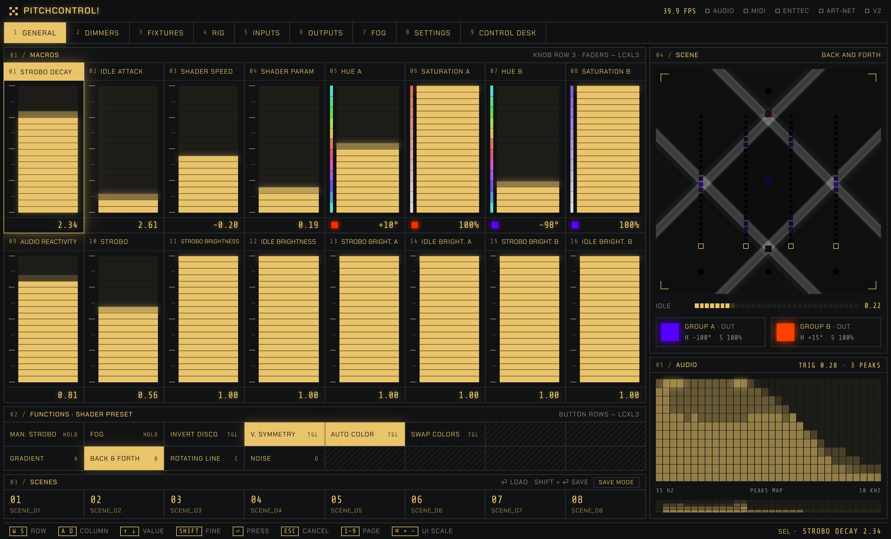
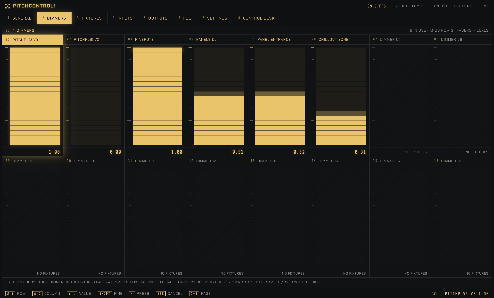
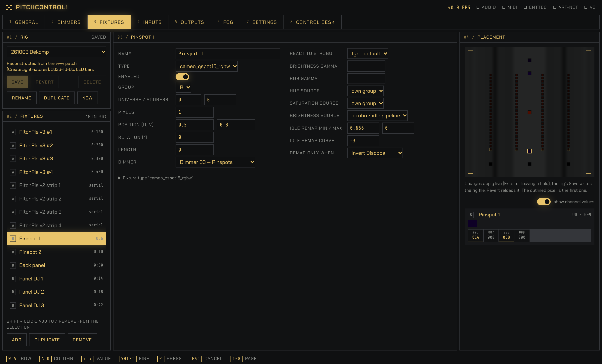
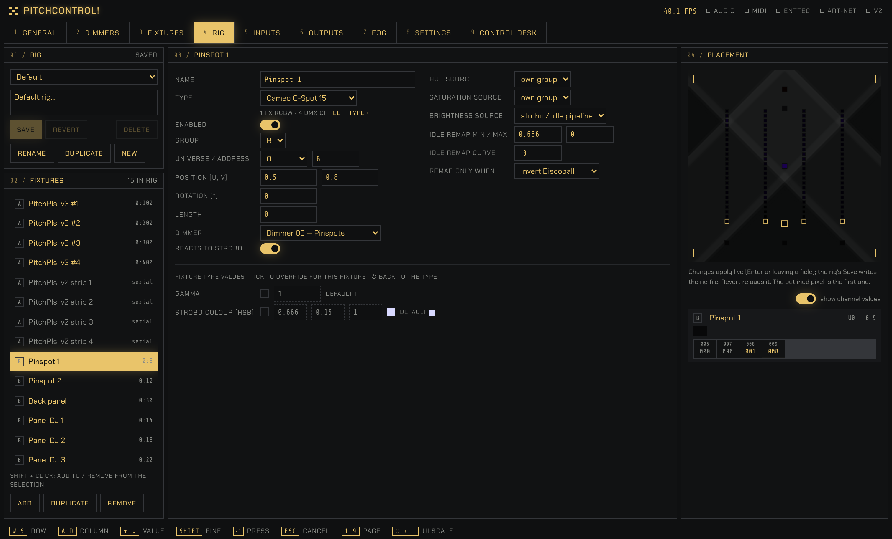
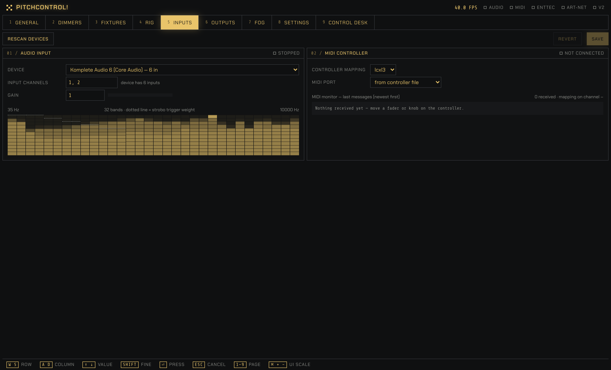
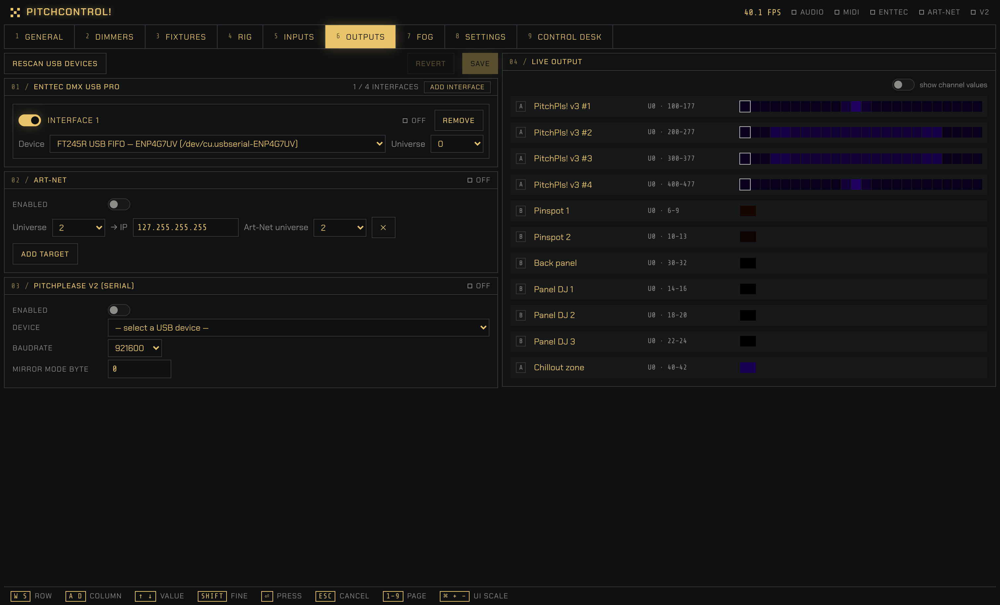
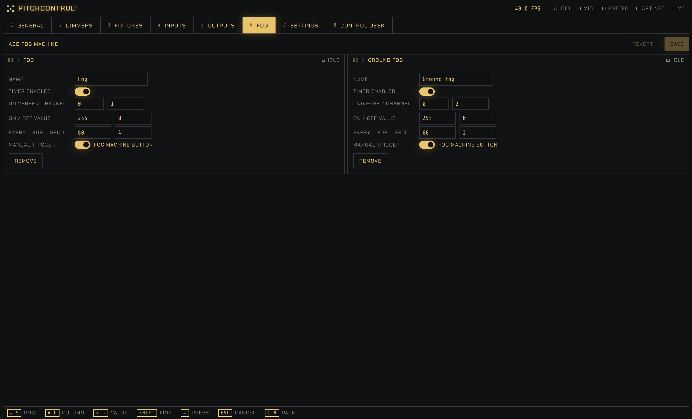
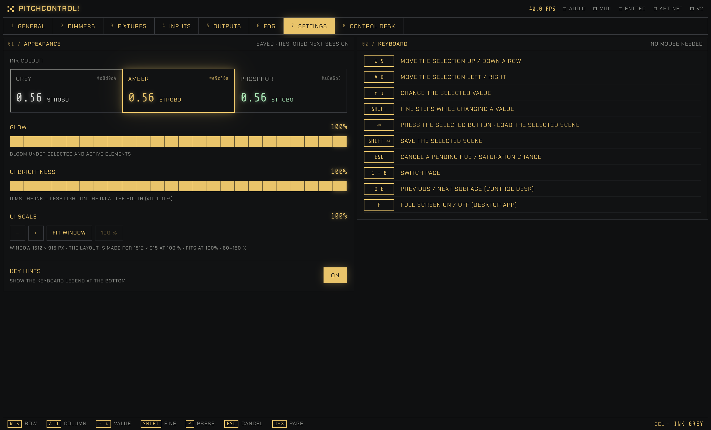
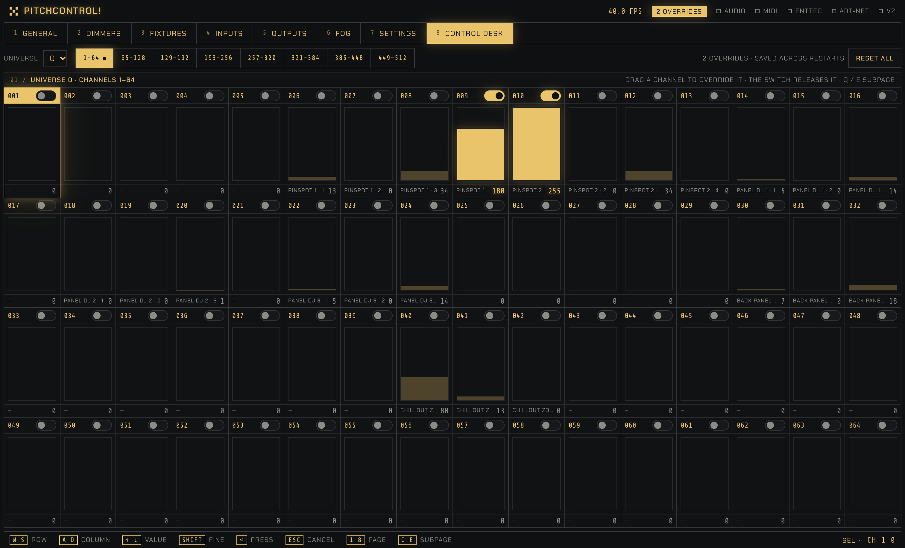

# PitchControl

Audio-reactive light control for PitchPlease, a cross-platform (macOS / Windows) port of the vvvv gamma patch in `../vl/`.
The design and the reverse-engineered vvvv logic are documented in the wiki: [PitchControl design](../docs/wiki/port-design.md) and [vvvv patch logic](../docs/wiki/vvvv-patch-logic.md).

- **Backend** (`backend/`, Python): the engine, which runs at 40 FPS in its own thread and owns audio, MIDI and all outputs. It keeps running if the browser is closed.
- **Frontend** (`frontend/`, Vite + React + TypeScript + Tailwind): the pages General, Dimmers, Fixtures, Inputs, Outputs, Fog, Settings and Control Desk. It talks to the backend over HTTP and a WebSocket.
- **Config** (`config/`): plain JSON, edited from the UI or by hand.

## Pages

Keys 1–9 switch between the pages. Everything can be operated from the keyboard (see [Using the UI](#using-the-ui)). The screenshots were taken at the 1512 × 915 design size with amber ink, without hardware connected (so audio, MIDI and the Enttec show as off), with a synthetic techno loop feeding the audio analysis.

### 1 · General



The page for playing the show:
- **Macros:** 16 faders for strobo decay, idle attack, shader speed and parameter, the two group colours (hue / saturation), audio reactivity and the strobo / idle brightness of each group. They map to the Launch Control XL's knob row 3 and faders.
- **Functions and shader presets:** manual strobo, fog, invert discoball, vertical symmetry, auto colour, swap colours, and the four mask presets Gradient, Back & Forth, Rotating Line and Noise.
- **Scenes:** the 8 scenes. ⏎ loads one, Shift + ⏎ (or save mode) stores the current macros into it.
- **Scene:** a live preview of the mask with every fixture pixel in the colour it is sending. Below it, the phase bar: strobo drains it after each peak, idle fills it back. Then the final colours of groups A and B.
- **Audio:** the 32 frequency bands with the peaks map that triggers the strobo.

### 2 · Dimmers



16 dimmer faders, one per group of lights; the Launch Control XL's page knob switches its faders between General and Dimmers. Each fixture picks its dimmer on the Rig page. A dimmer that no fixture uses is disabled (hatched, "no fixtures") and ignores MIDI. Double-click a name to rename it; Enter confirms, Esc cancels. The names are saved with the rig.

### 3 · Fixtures



The fixture types: everything shared by all fixtures of one model, one JSON file each in `config/fixtures/types/`.
- **Fixture types:** the list, with New, Duplicate, Rename and Delete. Renaming updates every rig that uses the type; a type that a rig uses can't be deleted.
- **Type editor:** description, output (DMX or the PitchPlease v2 serial protocol), pixel count, gamma and the strobo colour (HSB). Below that is the channel layout in DMX order. Each channel is a constant (e.g. master = 255), a macro (e.g. a strip dimmer following "Dimmer 01"), a shutter (open / strobe values) or the pixel block (R, RGB or RGBW). ↑ ↓ ✕ reorder and remove channels.
- **Channel map:** the resulting DMX channels with their numbers, the total, and how many fixtures of the type fit one universe.

Edits apply to the lights right away and mark the type unsaved; Save writes the file, Revert reloads it.

### 4 · Rig



The rig: the fixtures of one event and everything that differs per fixture.
- **Rig:** load, save, revert, rename, duplicate, create or delete rig files, and edit the description. Unsaved changes are flagged, and loading another rig asks first.
- **Fixtures:** the list of fixtures with Add / Duplicate / Remove. Shift + click selects several to edit them together.
- **Fixture editor:** name, type (with a summary and an "edit type" link), group, DMX universe and address, placement (position, rotation, length), dimmer, whether it reacts to strobo, colour sources and idle remap. Number fields step with ↑ / ↓ or a right-mouse drag.
- **Fixture type values:** gamma, the strobo colour and the named constant channels can be overridden per fixture. The checkbox switches an override on. Switched off, the field is greyed out but keeps its value, so switching it on again restores it; "default" shows the type's value, and ↺ goes back to it.
- **Placement:** the selected fixtures highlighted in the scene preview, their live output colours and, with "show channel values", a table of the DMX channels they write.

### 5 · Inputs



- **Audio input:** device, input channels and gain, with the 32-band meter. The dotted line shows how strongly each band counts towards the strobo trigger.
- **MIDI controller:** controller mapping and port, and a monitor of the last received messages, showing which macro each one moved or why it was ignored.

### 6 · Outputs



Up to four Enttec DMX USB Pro interfaces (Add interface / Remove; each with its own device and universe), Art-Net targets (universe → IP), and the PitchPlease V2 serial output (device, baud rate, mirror mode). Live output on the right shows what every fixture sends: pixel colours and, with "show channel values", the channel table.

### 7 · Fog



One panel per fog machine: DMX universe and channel, on / off values, a timer ("every … for … seconds"), and whether the Fog button on the General page (or the controller) fires it by hand. The header shows when it is fogging.

### 8 · Settings



- **Appearance:** ink colour (grey, amber, phosphor), glow, UI brightness for a dark booth, UI scale (with "Fit window" for small screens) and the key-hint footer. All of it is saved and restored next session.
- **Keyboard:** the complete keyboard reference.
- **App** (desktop app only): open the UI in a browser, open the data folder, start in full screen.

### 9 · Control Desk



Every DMX output channel as a slider: pick a universe (0–3) and a subpage of 64 channels (Q / E step through them). The faint bar is what the channel sends now, and the footer names the fixture using it. Dragging a channel, or switching it on, overrides it with the slider value; the switch releases it. Overrides survive restarts. While any are active, the header shows "N overrides", and "Reset all" releases them all after a confirmation.

## Download

Ready-to-run builds for macOS (Apple Silicon) and Windows are on the [Releases page](https://github.com/hlavamir/PitchPlease/releases/latest). Download the zip for your system and unpack it; no Python or Node needed. A downloaded app keeps its configuration in `Documents/PitchControl/` (created on first start with the default rig and fixture types). What changed between versions is in [CHANGELOG.md](CHANGELOG.md); the running version is shown in Settings → About.

## Run

**macOS:** double-click `run.command`. On first run it sets up the Python environment and builds the UI (it rebuilds when sources change), then starts the backend and opens the UI in the browser. Close the Terminal window to stop. Extra arguments are passed through, e.g. `./run.command --no-hardware`.

**Windows:** double-click `run.bat` — same behaviour (uses `uv` if installed, otherwise `py -3` / `python`).

Manual setup — requirements: Python ≥ 3.11 with [uv](https://docs.astral.sh/uv/), and Node 20.19 or newer, or 22.12 or newer (only to build the UI; Vite 8 refuses older versions).

```bash
cd pitch_control/backend
uv venv && uv pip install -e ".[dev]"
cd ../frontend && npm install && npm run build
cd ../backend && .venv/bin/python -m pitchcontrol
```

Open http://127.0.0.1:8420.

Options:
- `--no-hardware` runs without audio, MIDI and outputs.
- `--host 0.0.0.0` lets other devices (a phone) on the LAN reach the UI.
- `--port`, `--config`, `--logs` change the defaults.

On Windows, use `.venv\Scripts\python -m pitchcontrol`. ASIO devices appear in the Inputs page device list.

For frontend development, run `npm run dev` in `frontend/` (port 5173, proxied to the backend on 8420).

Tests: `cd backend && .venv/bin/python -m pytest`.

## Standalone app

`packaging/` builds a self-contained app (no Python or Node needed on the target machine). It must be built on the target OS:

- **macOS:** double-click `packaging/build_macos.command` (or run it from Terminal); it produces `dist/PitchControl.app` and `dist/PitchControl-macos-<arch>.zip` (about 46 MB, 22 MB zipped). An Apple Silicon build runs only on Apple Silicon Macs.
- **Windows:** double-click `packaging\build_windows.bat` (needs Node.js 20.19+ or 22.12+, and Python 3.11 or 3.12: `python-rtmidi` has no Windows wheels for newer Pythons, so the script picks 3.12 / 3.11 even when a newer one is installed too); it produces `dist\PitchControl\PitchControl.exe` and a zip. The window shows the steps and stays open at the end; everything the steps print goes to `pitch_control\build-windows.log` (gitignored), which is what to send when a build fails.
- **Both, on GitHub:** Actions → "PitchControl app" → Run workflow (`.github/workflows/pitchcontrol-app.yml`), then download the zips from the run.

The app shows the UI in its own window. "Open in browser" and "Open data folder" are in Settings → App. Closing the window stops the engine.

**Data folder:** the app works directly on the repo's `pitch_control/config/`, so rigs, fixture types, settings and scenes edited in the app can be committed. Logs go to `pitch_control/logs/` and the macro autosave to `config/state/`; both are gitignored. The build records where the repo is on the build machine. The folder is chosen in this order:

1. the `--data <folder>` option;
2. a folder path written in `~/Documents/PitchControl/data_folder.txt` (useful for an app built on GitHub, which doesn't know where your repo is);
3. the repo's `pitch_control/` folder;
4. `~/Documents/PitchControl/` as a fallback. Missing default files are copied in there, and existing files are never overwritten.

The builds are unsigned. On first launch:
- macOS: open the app once; when macOS refuses, go to System Settings → Privacy & Security and click "Open Anyway" (right-click → Open no longer bypasses this since macOS 15).
- Windows: SmartScreen → More info → Run anyway.

macOS asks once for microphone access.

App options (for example from a terminal) are the same as for the backend, plus `--data <folder>` and `--no-window` (use the browser instead of a window). `--host 0.0.0.0` makes the UI reachable from a phone on the LAN.

### Releasing a version

Versions follow semantic versioning (see [CHANGELOG.md](CHANGELOG.md)). The number lives only in `backend/src/pitchcontrol/__init__.py`.
1. Set `__version__`, and move the changelog's "Unreleased" notes under a `## X.Y.Z — date` heading.
2. Commit, then tag and push: `git tag -a pitchcontrol-vX.Y.Z -m "PitchControl X.Y.Z"` and `git push origin pitchcontrol-vX.Y.Z`.
3. The "PitchControl app" workflow checks that the tag matches `__version__`, builds macOS and Windows, and creates a **draft** release with that version's changelog section. Check it on GitHub, then publish it.

Builds between releases show how far past the last tag they are, e.g. `1.1.0+3 (abc1234)`.

## Using the UI

The UI is monochrome (Settings → Appearance: grey, amber or phosphor ink, glow strength, UI brightness, UI scale, key hints; saved in `settings.json`).

The layout is made for a 1512 × 915 px window (14" MacBook at its default display setting). On smaller screens, down to 1280 × 720, use Settings → Appearance → UI scale → **Fit window**: it picks the largest scale at which every page fits without scrolling (about 70 % on 1280 × 720). Pixel sizes are CSS pixels, which macOS and Windows scale with the display setting. Colour only appears where it carries information: the hue/saturation scales and the output colours.

Everything works without a mouse — one control is always selected. The footer lists the keys and mouse actions for the control under the mouse, with the keyboard focus (Tab) or selected with the navigation keys, with a short explanation of what it does. Every control, label, status indicator and panel has one; a control without its own tip shows the one of its row or panel:

| Key | Action |
|---|---|
| W / S | move the selection up / down a row |
| A / D | move the selection left / right |
| ↑ / ↓ | change the selected value (Shift = fine) |
| ⏎ | press the selected button, load the selected scene (Shift + ⏎ = save) |
| Esc | cancel a pending hue / saturation change |
| 1 – 9 | switch page |
| Q / E | previous / next subpage (Control Desk) |
| F | full screen on / off (desktop app; on a MacBook it also covers the camera-notch strip) |
| ⌘ / Ctrl + + − 0 | UI scale up / down (`=` works as `+`, no Shift needed), 0 = 100 % (⌘ on macOS, Ctrl on Windows) |

Number fields apply on Enter and keep the focus, so you can type the next value right away (Escape reverts). ↑ / ↓ or dragging up / down with the right mouse button changes the value in steps (Shift = fine steps): integers 1, floats 0.1 / 0.01, fixture rotation 15° / 1°.

On the Rig page, the **Rig** panel manages the rig file: load another rig from the dropdown, edit the description, Save / Revert, Rename, Duplicate (saves the current state, unsaved edits included, as a new rig and switches to it; the original file keeps what was saved), New (empty rig) and Delete (the active rig; the next one is loaded, the last rig can't be deleted). Loading or creating a rig with unsaved changes asks: Save, Discard or Cancel. Edits are live in the engine right away; only Save writes the file. The **Fixtures** panel below it edits the lights in the rig: Add, Duplicate, Remove.

In the fixture list, Shift + click adds fixtures to the selection (or removes them) to edit several at once. A field shows a value only if all selected fixtures share it, otherwise "multiple"; a value you enter applies to all of them.

**Control Desk** (page 8) shows every DMX output channel as a slider: pick the universe (0–3) and one of 8 subpages of 64 channels. The faint bar is what the channel sends now (the footer names the fixture using it). Dragging a channel, or switching it on, overrides it: it then sends the slider value instead of what the fixtures compute; the switch releases it. Overrides are saved (`config/state/overrides.json`, not in git) and restored on start; while any are active the header shows "N overrides". "Reset all" (with a confirmation) releases every override in every universe.

Hue and saturation apply on mouse release, or once keys / the MIDI knob rest; until then the fader shows the target with a dashed outline.

## Config folder

| Path | Content |
|---|---|
| `settings.json` | outputs (up to 4 Enttec interfaces, Art-Net, v2 serial), audio input, fog machines, Auto Color palette, engine options |
| `fixtures/types/*.json` | one file per fixture model (edited on the Fixtures page); all files are loaded on startup, missing keys get defaults |
| `rigs/<name>.json` | fixture instances for one event (edited on the Rig page): type, group A/B, universe/address, UV placement (rotation in degrees), dimmer, colour sources, overrides of type values as `{"enabled": …, "value": …}`; the dimmer names (`dimmer_names`) |
| `controllers/*.json` | MIDI controller mappings (CC → macro) |
| `scenes/scene_N.json` | the 8 scenes (macro name → control value) |
| `state/macros.json` | auto-saved macro values for crash recovery (not in git) |
| `state/overrides.json` | Control Desk channel overrides, restored on start (not in git) |

Unknown keys (typos) and broken files are reported in `logs/YYMMDD_hhmmss.log` (one file per start) and never stop the engine. Keys starting with `_` (e.g. `_note`) are annotations and are ignored.

A fixture **profile** is the ordered `channels` list of a fixture type:

```json
"channels": [
  { "name": "master", "value": 255 },
  { "name": "dimmer", "macro": "Dimmer 03" },
  { "name": "strobe", "shutter": { "open": 0, "strobo": 200 } },
  { "pixels": "RGB" }
]
```

`value` is a constant (a rig can override it by name with `channel_values`). `macro` sends a macro's value as 0–255. `shutter` sends `strobo` on a peak frame when the instance has `real_strobo` enabled. `pixels` expands to pixel count × `R` / `RGB` / `RGBW`.

To re-import the vvvv scenes and `macros.ini`: `.venv/bin/python -m pitchcontrol.legacy`.

## Status (2026-10-05)

Working and covered by tests:
- config loading and typo reporting;
- the v3 DMX frame (checked against the v3.2 firmware layout);
- Enttec Pro, Art-Net and v2.2 serial packet formats;
- the 32-band analysis with octave-weighted strobo trigger;
- the phase, strobo/idle and colour logic;
- the mask generators and noise port, crossfade and symmetry;
- scenes, the REST API and the WebSocket.

The UI runs against the engine at 40 FPS in no-hardware mode.

Verified by Miro on macOS: audio input and analysis (microphone test), the LCXL3 MIDI controller, and DMX output through the Enttec DMX USB Pro to one Cameo pinspot (2026-10-07). **Not yet verified on hardware:** Art-Net and v2 serial output, and the Windows build. Fixture details and the LCXL3 mapping were confirmed by Miro on 2026-10-05.

The masks match the vvvv look so far, except that Back and Forth rotates in 45° steps (vvvv: 90°); left as is for now.
