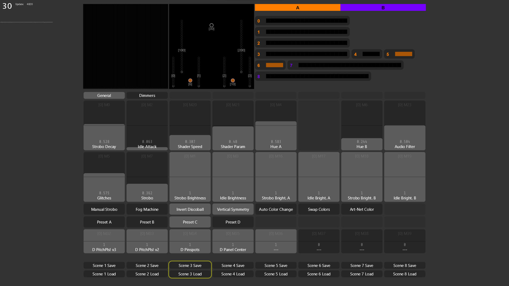
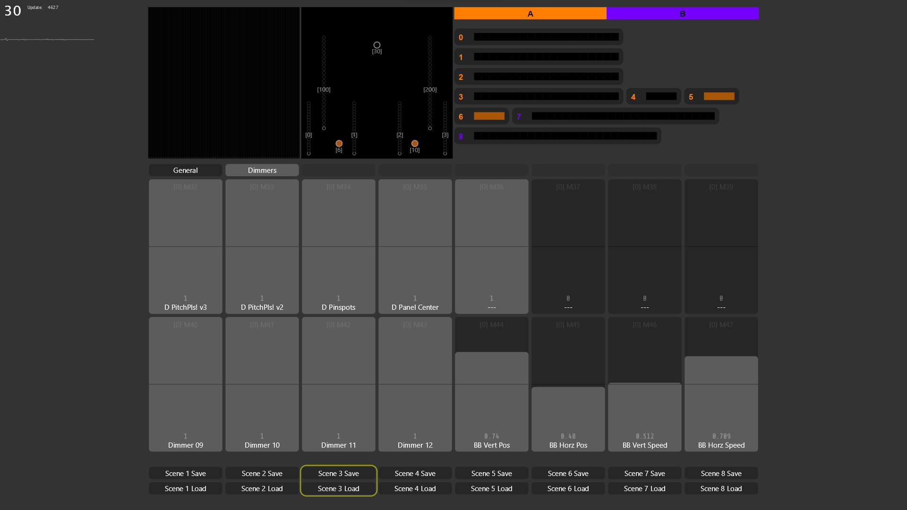

# vvvv Gamma Patch

> The central control software: a vvvv gamma 7.3 patch that combines audio analysis, MIDI and UI input, GPU-based visual generation, and hardware output to all PitchPlease light fixtures.

**File:** `vl/root_gamma_7-3.vl`
**vvvv version:** gamma 7.3

## UI Screenshots

**General tab** — main macro controls, fixture placement, group A/B channels:


**Dimmers tab** — per-fixture dimmers and BB parameters:


## Signal Flow Overview

```
Audio input
    ↓
FFT + normalization + peak detection (AudioData)
    ↓
1D texture (FFT spectrum encoded per pixel)
    ↓
2D shader (uses 1D texture as lookup — warps audio across 2D space)
    ↓
Idle mask + peaks map compositing (MixIdleMaskWithPeaksMap)
    ↓
Light fixtures sampled from GPU texture (UV positions in 2D scene)
    ↓
RGB/RGBW per fixture pixel → serial (v1/v2) or DMX (v3)
```

MIDI and on-screen UI drive a **MacrosManager** that feeds parameters into every stage of this pipeline.

## Audio Analysis

Audio is captured from a selected device and channel(s). The `SignalToSpectrum` process runs FFT on the signal and outputs a **normalised spectrum** — the signal is scaled between 0 and the maximum level detected, which decays slowly over time. Peak detection runs on the normalised FFT output and produces:

- `Peak` — boolean, fires on detected transients
- `Peak Score` — magnitude of the peak
- `Peak Detection Max / Min` — normalisation bounds

The processed audio is wrapped in an `AudioData` object and passed through the patch. The FFT spectrum is encoded as a **1D texture** (1px tall, one pixel per frequency bin) which feeds into the shader stage.

A `Preshape FFT Values` parameter (default 0.4) applies a curve to the FFT before it is encoded, controlling how aggressively the lower vs. higher frequency bins are represented.

## 2D Shader Stage

The 1D audio texture is combined with one of several **preset background shaders**, each producing a black-and-white spatial gradient:

- Static vertical gradient
- Horizontally or vertically moving line with falloff
- Line with falloff rotating around the centre
- 2D Perlin noise (`GeneratorNoise_TextureFX.sdsl`)

In each case the **brightness of the background image** is used as a U coordinate to sample into the 1D audio texture. This warps the audio spectrum differently across 2D space depending on which shader is active — bright areas of the background map to high-frequency audio energy, dark areas to low-frequency.

An optional **VerticalSymmetry** pass (`VerticalSymmetry_TextureFX.sdsl`) mirrors the 2D image around the horizontal centre.

The result is then composited with an **idle mask** and a **peaks map** using `MixIdleMaskWithPeaksMap_TextureFX.sdsl`. The idle mask accumulates audio data over time (`AddAudioDataToIdleMask`) and fades in during quiet periods; the peaks map highlights transient audio peaks.

> Note: the shader-based approach was chosen so the full 2D "scene" is visible on screen during performance. A more efficient path would compute brightness directly at each fixture's UV position on the CPU (or even on the ESP32), skipping GPU readback entirely.

## Light Fixtures

Each fixture is a `LightFixture` record placed at a UV position in the 2D scene. The patch samples the rendered texture at each fixture's position to get a brightness value, then combines it with group hue and dimmer settings to produce final RGB or RGBW values. `UpdateLightFixtures` runs this per-frame.

The UI shows a **fixture placement panel** (centre of screen) visualising all fixtures in UV space. Currently visible fixtures:

| ID | Type | Notes |
|---|---|---|
| [0]–[3] | Strip | PitchPlease **v2.2** strip IDs (not DMX addresses) |
| [6] | Point (orange dot) | **Cameo Q Spot 15 RGBW** — pinspot at DMX address 6 |
| [10] | Point (orange dot) | **Cameo Q Spot 15 RGBW** — pinspot at DMX address 10 |
| [30] | Point (circle icon) | **Stairville Beam Ball 100 Quad LED** — RGBW moving head at DMX address 30 |
| [100] | Strip array | PitchPlease v3 Unit 1 |
| [200] | Strip array | PitchPlease v3 Unit 2 |

Fixtures are organised into two groups — **A** (orange) and **B** (purple) — each with 9 independent channels (0–8) for hue and brightness control.

## Strobo / Idle Logic

On detected audio peaks, the patch can trigger a **strobo** moment. After strobo decays (`Strobo Decay`), the patch enters **idle attack** mode where normal operation fades back in (`Idle Attack`). Whether a fixture responds to strobo is configured per fixture. A `Manual Strobo` macro can force strobo on the next peak.

States flowing through the patch: `On Peak` → `Strobo` → `Idle`.

## Macros

All controllable parameters are unified as **macros** — a named array of float values fed by MIDI, on-screen UI, and (future) the phone bridge. Macros are saved to `vl/macros.ini` at regular intervals so the patch can recover from a crash.

The UI has two tabs: **General** (main controls) and **Dimmers** (per-fixture dimmers).

### General tab — fader macros

| M index | Label | Notes |
|---|---|---|
| M0 | Strobo Decay | How fast strobo fades |
| M1 | Strobo Brightness | Peak strobo brightness |
| M2 | Idle Attack | How fast idle fades in after strobo |
| M3 | Idle Brightness | Brightness during idle |
| M4 | Hue A | Hue for group A (orange) |
| M5 | Glitches | Controls 1D audio texture construction — higher = more aggressive output |
| M6 | Hue B | Hue for group B (purple) |
| M7 | Strobo | Strobo sensitivity/level |
| M16 | Strobo Bright. A | Strobo brightness for group A |
| M17 | Idle Bright. A | Idle brightness for group A |
| M18 | Strobo Bright. B | Strobo brightness for group B |
| M19 | Idle Bright. B | Idle brightness for group B |
| M20 | Shader Speed | Speed of background shader animation |
| M21 | Shader Param | Secondary shader parameter |
| M23 | Audio Filter | Audio signal filtering |

### General tab — buttons

| Button | Function |
|---|---|
| Manual Strobo | Forces strobo on next audio peak |
| Fog Machine | Triggers fog machine |
| Invert Discoball | Inverts brightness of selected fixtures |
| Vertical Symmetry | Mirrors 2D shader image around horizontal centre |
| Auto Color Change | Changes colour after a random number of strobo moments |
| Swap Colors | Swaps colour assignment between groups |
| Art-Net Color | Toggles between received ArtNet hue (from MadMapper on second laptop) and vvvv's own colour logic |

### General tab — shader presets

Four background shader presets selectable via buttons: **Preset A**, **Preset B**, **Preset C**, **Preset D**. These correspond to the four background shaders described in the [2D Shader Stage](#2d-shader-stage) section.

### Dimmers tab

The "Dimmers" tab is a slight misnomer — the 16 faders here are not only brightness controls but **generic static DMX channel outputs**. Some drive master dimmers for LED strip groups; others output fixed DMX values to control specific parameters of third-party fixtures (position, speed, etc.).

| M index | Label | Notes |
|---|---|---|
| M32 | D PitchPlsl v3 | Master dimmer for PitchPlease v3 fixtures |
| M33 | D PitchPlsl v2 | Master dimmer for PitchPlease v2 fixtures |
| M34 | D Pinspots | Master dimmer for Cameo Q Spot 15 RGBW pinspots (DMX addresses 6 and 10) |
| M35 | D Panel Center | Master dimmer for the centre LED panel fixture (Stairville, model unknown — single-colour RGB panel, treated as one pixel) |
| M36–M39 | (unlabeled) | Unassigned dimmers |
| M40–M43 | Dimmer 09–12 | Generic dimmers |
| M44 | BB Vert Pos | Stairville Beam Ball — tilt position (ch2 in DMX 7-ch mode) |
| M45 | BB Horz Pos | Stairville Beam Ball — pan position (ch1 in DMX 7-ch mode) |
| M46 | BB Vert Speed | Stairville Beam Ball — vertical movement speed |
| M47 | BB Horz Speed | Stairville Beam Ball — horizontal movement speed |

**BB** = **Stairville Beam Ball 100 Quad LED** — a 10×10W RGBW moving head (540° pan, infinite tilt) at DMX address 30. The BB macros were an earlier direct-control approach; at events the Beam Ball was actually driven by **MadMapper on a second laptop via ArtNet**, with vvvv receiving the ArtNet stream and remapping it. The "Art-Net Color" button switches between using the received hue or vvvv's own colour logic. See [[fixtures]] for full specs and the ArtNet workflow.

## Scene System

Eight scenes (`vl/Scenes/Scene1.ini` – `Scene8.ini`) are simply saved presets of the full macro state. Scenes can be saved or loaded at any time from the patch UI or MIDI controller. They are not organised by theme — each is a freely configurable snapshot.

## Hardware Connections

| Hardware | Protocol | Interface |
|---|---|---|
| [[v1]] (Arduino mono) | Serial, 57600 baud | USB |
| [[v2]].0 (2 strips) | Serial, 57600 baud | USB |
| [[v2]].2 (4 strips R4) | Serial, 921600 baud | USB |
| [[v3]] (ESP32 DMX) | DMX512 via Enttec Pro | USB-DMX |
| [[v3]] (ESP32 DMX) | ArtNet → QLC+ → Enttec Open | USB-DMX (fallback: Enttec Pro unavailable or extra DMX universe needed) |
| Any DMX fixture | DMX512 direct or via QLC+ | — |

For v3, both devices (DMX addresses 100 and 200) can be driven simultaneously. `SetDMXChannels` and `SetDMXOutputConfig` handle DMX framing; `SerialLog` handles serial output.

## MIDI Controller

A Novation Launch Control XL Mk3 is used for live performance — scene switching, macro control. MIDI input is handled by `MidiHardwareController` using `VL.IO.Midi`. The controller state is read per MIDI channel and controller number via `ControllerState` nodes inside a `ForEach` region.

## Custom HLSL Shaders

Three `TextureFX` shaders in `vl/shaders/` (SDSL, a superset of HLSL):

- **`GeneratorNoise_TextureFX.sdsl`** — animated 3D simplex noise background
- **`VerticalSymmetry_TextureFX.sdsl`** — mirrors the 2D scene image around horizontal centre
- **`MixIdleMaskWithPeaksMap_TextureFX.sdsl`** — composites idle mask with audio peaks map

## Shader Development

A separate Visual Studio / sdpkg project in `vl/EditShaders/` is used for developing and testing shaders outside the main patch.

## File Layout

| File/Folder | Purpose |
|---|---|
| `vl/root_gamma_7-3.vl` | Main patch (rename pending) |
| `vl/vl/VL.Devices.ENTTEC.vl` | Enttec device library (DMX output) |
| `vl/shaders/` | Custom HLSL/SDSL TextureFX shaders |
| `vl/Scenes/` | Scene preset INI files (8 scenes) |
| `vl/macros.ini` | Current macro state, auto-saved for crash recovery |
| `vl/EditShaders/` | Shader development project |

## See Also

- [[v1]], [[v2]], [[v3]] — Hardware targets
- [[hardware]] — USB-DMX interfaces
- [[fixtures]] — Third-party fixtures (Beam Ball, pinspots)
- [[wifi-bridge]] — Future: phone remote control via vvvv
